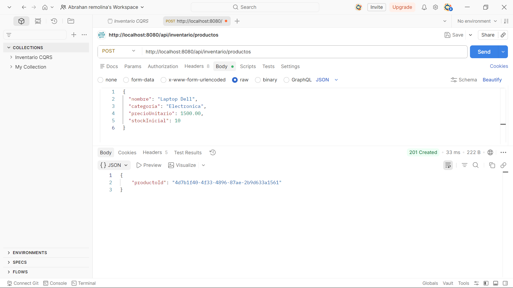
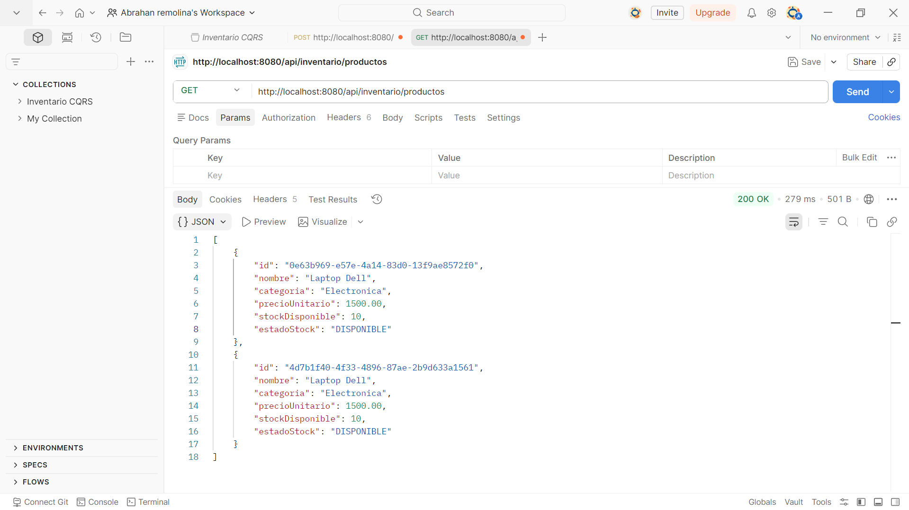
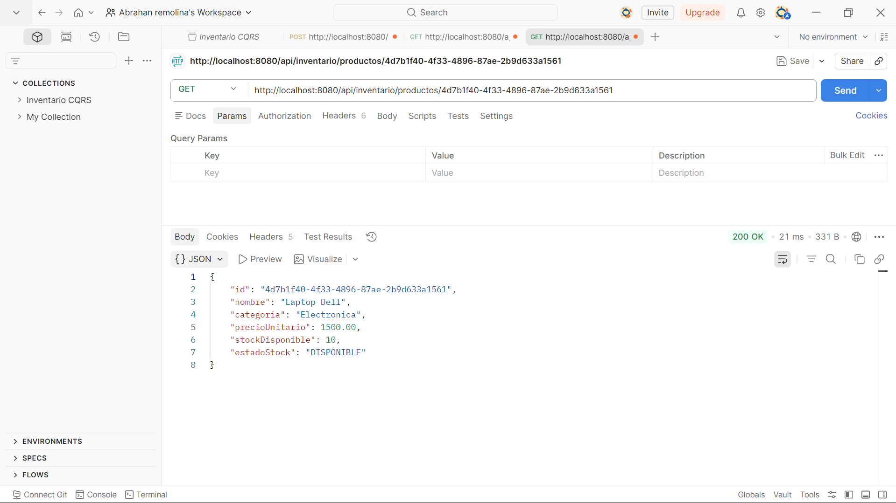
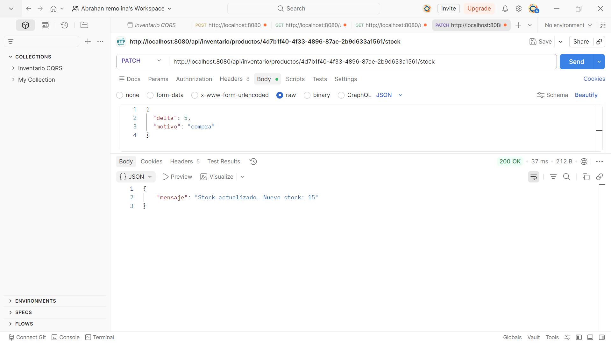
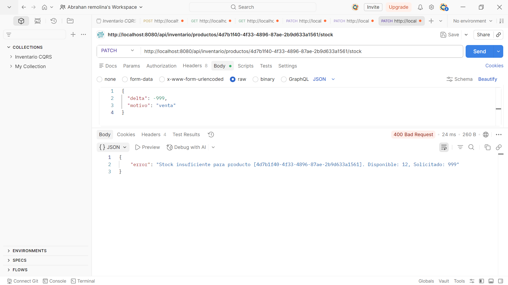

# Inventario CQRS — Post-Contenido 2 Unidad 8

Implementación del patrón **CQRS (Command Query Responsibility Segregation)** en un sistema de gestión de inventario usando Spring Boot 3.x y Java 17.

## Arquitectura CQRS

```
┌─────────────────────────────────────────────────────┐
│                   HTTP Request                       │
└─────────────────────┬───────────────────────────────┘
                      │
              ProductoController
                      │
         ┌────────────┴────────────┐
         │                         │
   COMMAND SIDE               QUERY SIDE
   (Escritura)                (Lectura)
         │                         │
┌────────▼────────┐      ┌─────────▼────────┐
│ CommandHandlers │      │  QueryHandlers   │
│                 │      │                  │
│ - Agregar       │      │ - Listar         │
│ - ActualizarStock│     │ - Buscar         │
│ - Eliminar      │      └─────────┬────────┘
└────────┬────────┘                │
         │                         │
┌────────▼────────┐      ┌─────────▼────────┐
│  Dominio Rico   │      │  ProductoView    │
│  (Producto.java)│      │  (record DTO)    │
└────────┬────────┘      └─────────┬────────┘
         │                         │
┌────────▼─────────────────────────▼────────┐
│           Infrastructure (JPA / H2)        │
│   ProductoWriteRepositoryImpl              │
│   ProductoReadRepositoryImpl               │
└───────────────────────────────────────────┘
```

### Diferencia clave entre los dos stacks

| Aspecto | Command Side | Query Side |
|---|---|---|
| Propósito | Modificar estado | Leer estado |
| Modelo | Entidad de dominio rica | Record DTO optimizado |
| Lógica | Reglas de negocio | Lógica de presentación |
| Métodos HTTP | POST, PATCH, DELETE | GET |
| Retorna | ID o mensaje | ProductoView o lista |

## Estructura del Proyecto

```
com.example.inventariocqrs/
├── domain/
│   ├── Producto.java
│   ├── ProductoId.java
│   ├── ProductoNotFoundException.java
│   └── StockInsuficienteException.java
├── command/
│   ├── AgregarProductoCommand.java
│   ├── ActualizarStockCommand.java
│   ├── EliminarProductoCommand.java
│   ├── handler/
│   │   ├── AgregarProductoHandler.java
│   │   ├── ActualizarStockHandler.java
│   │   └── EliminarProductoHandler.java
│   └── repository/
│       └── ProductoWriteRepository.java
├── query/
│   ├── BuscarProductoQuery.java
│   ├── ListarProductosQuery.java
│   ├── handler/
│   │   ├── BuscarProductoQueryHandler.java
│   │   └── ListarProductosQueryHandler.java
│   ├── model/
│   │   └── ProductoView.java
│   └── repository/
│       └── ProductoReadRepository.java
├── infrastructure/
│   ├── persistence/
│   │   ├── ProductoEntity.java
│   │   ├── ProductoJpaRepository.java
│   │   ├── ProductoWriteRepositoryImpl.java
│   │   └── ProductoReadRepositoryImpl.java
│   └── exception/
│       └── GlobalExceptionHandler.java
└── adapter/web/
    └── ProductoController.java
```

## Requisitos

- Java JDK 17+
- Maven 3.8+
- Spring Boot 3.x

## Instrucciones de Ejecución

**1. Clonar el repositorio:**
```bash
git clone https://github.com/Abrahan07/Patrones-Remolina-post2-u8.git
cd Patrones-Remolina-post2-u8
```

**2. Compilar y ejecutar:**
```bash
mvn spring-boot:run
```

**3. Verificar que el servidor esté corriendo:**
```
http://localhost:8080
```

## Endpoints Disponibles

### Command Side (modifican estado)

| Método | Endpoint | Descripción |
|---|---|---|
| POST | `/api/inventario/productos` | Crear un producto |
| PATCH | `/api/inventario/productos/{id}/stock` | Actualizar stock |
| DELETE | `/api/inventario/productos/{id}` | Eliminar producto |

### Query Side (solo lectura)

| Método | Endpoint | Descripción |
|---|---|---|
| GET | `/api/inventario/productos` | Listar todos los productos |
| GET | `/api/inventario/productos?soloDisponibles=true` | Listar solo disponibles |
| GET | `/api/inventario/productos/{id}` | Buscar producto por ID |

## Ejemplos de Uso

**Crear producto:**
```bash
curl -X POST http://localhost:8080/api/inventario/productos \
  -H "Content-Type: application/json" \
  -d '{
    "nombre": "Laptop Dell",
    "categoria": "Electronica",
    "precioUnitario": 1500.00,
    "stockInicial": 10
  }'
```

**Actualizar stock:**
```bash
curl -X PATCH http://localhost:8080/api/inventario/productos/{id}/stock \
  -H "Content-Type: application/json" \
  -d '{"delta": 5, "motivo": "compra"}'
```

**Listar productos:**
```bash
curl http://localhost:8080/api/inventario/productos
```

## Capturas de Pruebas

### 1. Crear producto — POST 201


### 2. Listar productos — GET 200


### 3. Buscar por ID — GET 200


### 4. Incrementar stock — PATCH 200


### 5. Reducir stock — PATCH 200


### 6. Stock insuficiente — PATCH 400


## Tecnologías

- Java 17
- Spring Boot 3.x
- Spring Data JPA
- H2 Database (en memoria)
- Maven
